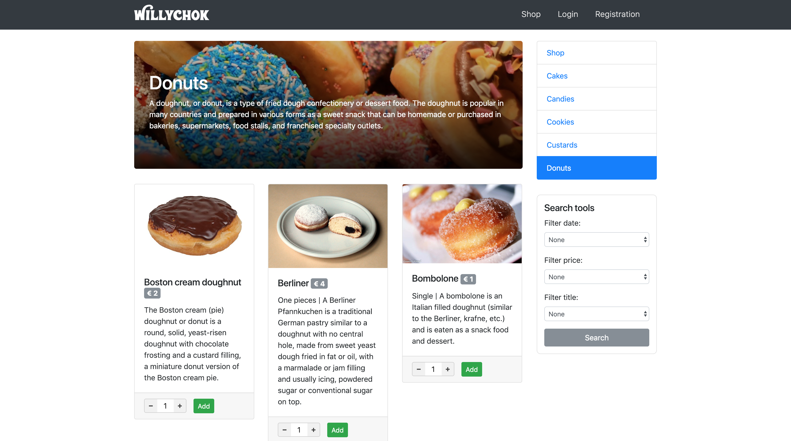

# EasyECommerce

Fast and easy e-commerce template for restaurant.
This is a very basic e-commerce framework that may help someone to start to write an e-commerce website from scratch.

## Installation
1. Create a database;
2. open the file /installation/createDatabaseTable.sql and then inject the sql code in your database;
3. open inc/Database/Db.php and write the information to access to your database: HOST, DBNAME, USERNAME, PASSWORD;
4. Enjoy.

## Preview
I want to report some preview of the website. You can also check by yourself by visiting this link 
[http://alericcardi.altervista.org/EasyECommerce](http://alericcardi.altervista.org/EasyECommerce).
### Shop 

### Cart 

### Checkout 

### Dashboard 

